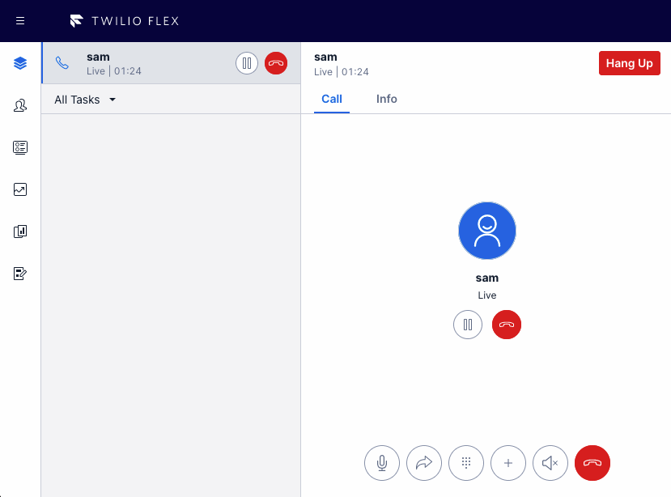

NOTE: This repo is still a WIP (Work In Progress) and the codebase is not yet production ready.

# Pause & Resume Call Recording

This feature adds a Pause/Resume Recording button to the call canvas to allow the agent to temporarily pause the call recording before the customer provides sensitive information (such as credit card details, bank account, etc.) to the agent and to resume regular call recording afterwards.

## How it works

This plugin uses Twilio Functions to allow user to pause or resume the call recording by calling utilizing the dual channel recording feature which is also an another twilio function.

# flex-user-experience

# setup and dependencies

Recording must be enabled either via the dual channel recording feature in this repository, or via the "Call Recording" setting in Twilio Console > Flex > Manage > Voice. Do not enable both recording methods simultaneously, or only one of the recordings will be paused.

There are no additional setup steps required.

# how it works

This plugin leverages Twilio Functions to perform the actual Pause and Resume action on the call or conference resource. When using the dual channel recording feature, the recording is on the call resource; when using the out-of-box recording feature, the recording is on the conference resource.