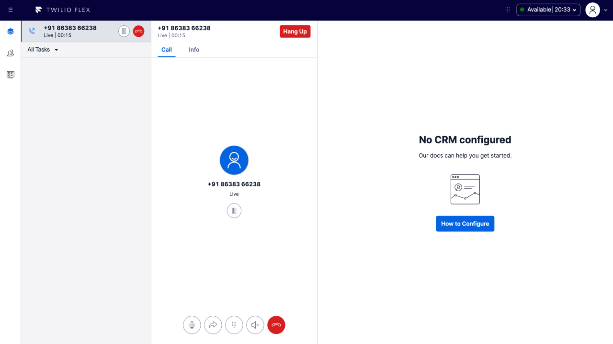

# Pause & Resume Call Recording

This feature adds a Pause/Resume Recording button to the call canvas to allow the agent to temporarily pause the call recording before the customer provides sensitive information (such as credit card details, bank account, etc.) to the agent and to resume regular call recording afterwards.

## How it works

This plugin uses Twilio Functions to allow user to pause or resume the call recording by calling utilizing the dual channel recording feature which is also an another twilio function.


# flex-user-experience



# setup and dependencies

Recording must be enabled either via the dual channel recording feature in this repository, or via the "Call Recording" setting in Twilio Console > Flex > Manage > Voice.

There are no additional setup steps required.

## Flex Plugin

This repository is a Flex plugin with some other assets. The following describing how you setup, develop and deploy your Flex plugin.

### Setup

Make sure you have [Node.js](https://nodejs.org) as well as [`npm`](https://npmjs.com) installed.

Afterwards, install the dependencies by running `npm install`:

```bash
# If you use npm
npm install
```

### Development

In order to develop locally, you need to configure appconfig to do that.

```bash
cp ui-src/public/appConfig.example.js ui-src/public/appConfig.js
```

Add the environment and your account to setup appconfi.

After that you can use the Twilio CLI to run the plugin locally. Using your commandline run the following from the root dirctory of the plugin.

```bash
twilio flex:plugins:start
```

This will automatically start up the Webpack Dev Server and open the browser for you. Your app will run on `http://localhost:3000`.

When you make changes to your code, the browser window will be automatically refreshed.

## Twilio Serverless

You will need the [Twilio CLI](https://www.twilio.com/docs/twilio-cli/quickstart) and the [serverless plugin](https://www.twilio.com/docs/labs/serverless-toolkit/getting-started) to deploy the functions inside the `serverless` folder of this project. You can install the necessary dependencies with the following commands:

`npm install twilio-cli -g`

and then

`twilio plugins:install @twilio-labs/plugin-serverless`

# How to use

1. Setup all dependencies above: the workflow and Twilio CLI packages.

2. Clone this repository

3. Copy `.env.example` to `.env` and set the following variables:

   - REACT_APP_SERVICE_BASE_URL: your Twilio Functions base url (this will be available after you deploy your functions). In local development environment, it could be your localhost base url.
   - REACT_APP_TASK_CHANNEL_SID: the voice channel SID

   **Note**: Remember that .env is for front-end use so do not add any type of key/secret variable to them. When developing, the .env.development is used while the .env.production is used when building and deploying the plugin. Also, just variables starting with the name _REACT*APP*_ will work.

4. run `npm install`

5. copy `./serverless/.env.sample` to `./serverless/.env` and populate the appropriate environment variables.

```
ACCOUNT_SID=
AUTH_TOKEN=
TWILIO_WORKSPACE_SID=
```

6.  cd into ./functions/ then run

`npm install`

and then

`twilio serverless:deploy`

(optionally you can run locally with `twilio serverless:start --ngrok=""`)

After successfull deployment you should see at least the following:
```bash
✔ Serverless project successfully deployed
Functions:
   https://<your base url>/call-recording/create-recording
   https://<your base url>/call-recording/list-recordings
   https://<your base url>/call-recording/pause-recording
   https://<your base url>/call-recording/resume-recording
```

Your functions will now be present in the Twilio Functions Console and part of the "pause-recording" service. Copy the URL from one of the functions and paste it in .env file in ui-src directory.


### Laundry List of activities to be done for each plugin

1. Create individual repo for each plugin
2. Test the plugin against Felx UI 2.x for compatibility
3. Create plugin specific CI/CD files for (actions file for bundle creation, release creation and running unit tests)
4. UI logs to be replaced with standard ConsoleLogger provided as util in the repo
5. Unit test for UI code and serverless code
6. Snyk integration for security vulenrabilities (fix them if there are any)
7. CodeCov integration for testing coverage (min threshold is 80%)
8. Telemetry (varies from plugin to plugin) - Make use of the manager.reportPluginInteraction() to send the event data to Kibana
9. For logging, console.log/warn/error should be effecrively used with enough contextual information (these will by default show up in debugger once enabled)
10. Exception handling with degraded UX or information to UI along with serverless retry mechanism (for wherever applicable)

- 5xx should be handled with retry mechanism (max of 3 attempts)
- 4xx should be reported back to user saying "Please try after some time...."

11. E2E test suite for the entire plugin
12. For E2E or any automated test, container components and user interactable child components must have ID attribute set.
13. Details.md file to have content that needs to show up on PluginsLibrary frontend
14. Should have License file in the repo
15. Updating the readme.md
16. Plugin template should have a screeshot folder, which contains one image (jpg, png, gif) of AA X BB resolution.
